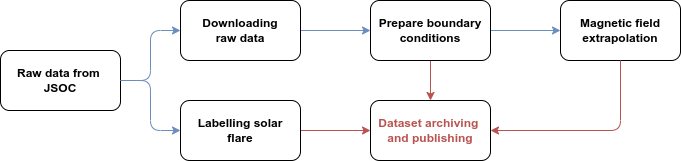

The whole database construction is divided into data filtering, raw data downloading, boundary condition preparation, batch calculation, tagging, data archiving and publishing, you can find the construction details from [this article](https://nlfff.dataset.deepsolar.space).

