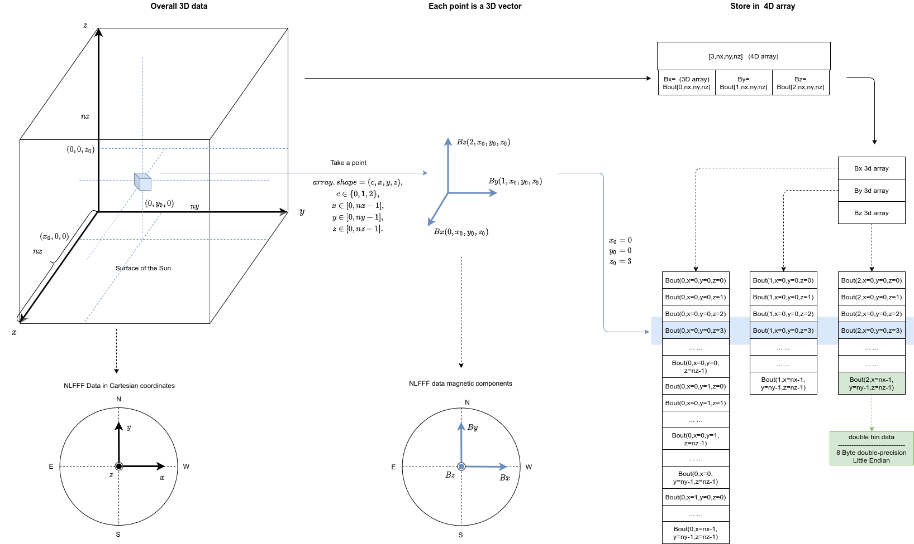

The main product file is Bout.bin file, which stores nlfff magnetic field data, the storage format is a four-dimensional array according to line priority (c style), the 0th dimension of the array is the component flag, 123 dimensions indicate the xyz coordinate values of Bx, By, Bz respectively, xyz take the value range with the last layer of grid, the storage data unit is Gaussian, you can get more from [this article](https://todo.com) More details, If you use python, you can also use pynlfff to read and write operations, if you use other languages, you can refer to python implementation.

