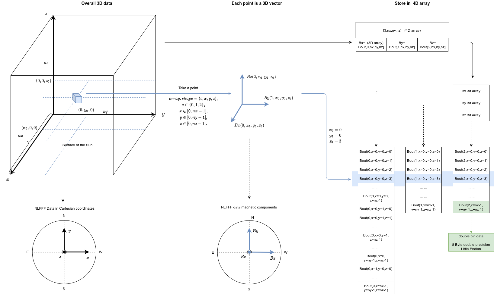

主要产品文件为Bout.bin文件，存储nlfff磁场数据，存储格式为按行优先级的四维数组（c风格），数组的第0维为分量标志，123维分别表示Bx、By、Bz的xyz坐标值，xyz取值范围与上一层网格一致，存储数据单位为高斯，你可以从[本文](https://nlfff.dataset.deepsolar.space)获得的更多细节，如果你使用python，你也可以使用[pynlfff](https://github.com/deepsolar/pynlfff)进行读写操作，如果你使用其他语言，你可以参考python的实现。

